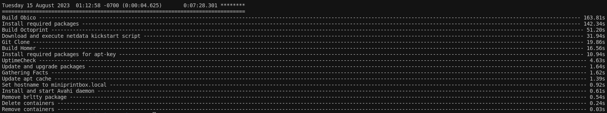

### Configuration

Once the Ansible script has completed, the Homer Dashboard will serve as the main collection of links for each program.

Octoprint Login Credentials:
username: admin
password: password

Obico Login Credentials:
username/email: admin@example.com
password: password


Clone Git Repo:

``` 
git clone https://github.com/hentronnumerouno/miniprintbox.git 
```

Begin Installation:

```
cd install
./install.sh
```
Once the installation is completed, the script will display the overview of the tasks, including the time it took to complete.
[](images/ansible_time.png)

