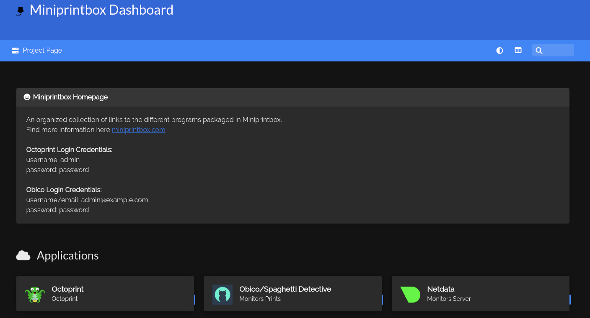

Once the Ansible script has completed, the Homer Dashboard will serve the information for each service.

##### Octoprint Login Credentials:
- username: admin
- password: password

##### Obico Login Credentials:
- username/email: admin@example.com
- password: password

Homer Dashboard Preview:

