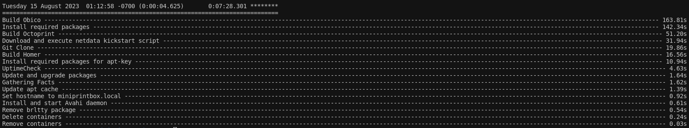

## Installation

Tested on Ubuntu 22.04, other versions may work as well.

!!! warning

    Always ensure that important data is backed up before executing this script.

Clone Git Repo:

``` 
git clone https://github.com/hentronnumerouno/miniprintbox.git 
```

Begin Installation:

```
cd install
./install.sh
```
Once the installation is completed, the script will display the overview of the tasks, including the time it took to complete.
[](images/ansible_time.png)