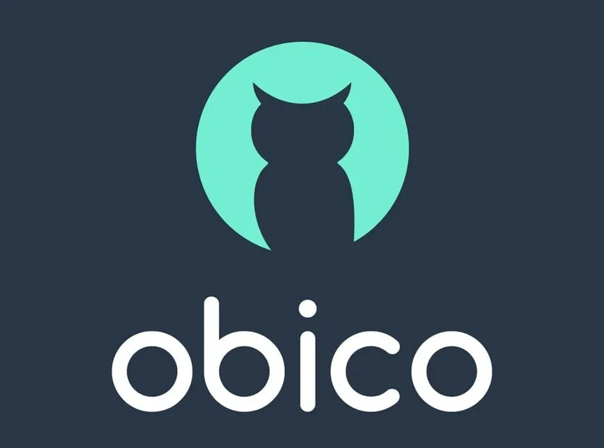

A resourceful project to monitor 3D prints on a budget. Leverage the power of Obico for print monitoring and Octoprint for printer control in a self-hosted environment.

    


## Installation

Tested on Ubuntu 22.04, other version may work as well.

!!! danger

```
Always ensure that important data is backed up before beginning installation! 
```

Update System

```
sudo apt update
sudo apt upgrade 
```