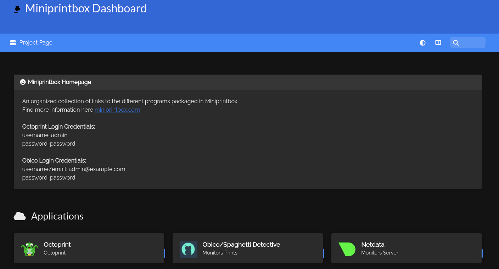
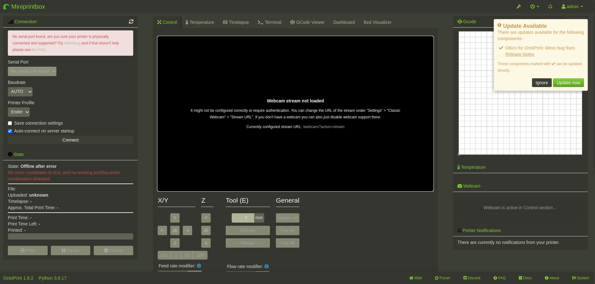

Once the Ansible script has completed, the Homer Dashboard will serve the information for each service.

Homer Dashboard Preview:

### Octoprint Setup:
##### Octoprint Login Credentials
- username: admin
- password: password

Once logged in the printer and general config parameters can be modified.

### Obico Setup:
##### Obico Login Credentials
- username/email: admin@example.com
- password: password

### Wi-Fi Connect Tool
It is recommended to use a Miniprintbox with a hardwired ethernet connection but they also have a built-in Wi-Fi chip which can be configured via Wi-Fi using the built-in connection tool. 

The program will first check to see if the device is connected to the internet, if it is, it will wait and check again in 10 seconds. Once internet is not available it will broadcast its own SSID (Wi-Fi network) named "Miniprintbox". 

- SSID: Miniprintbox
- password: letsprint

Once connected to the device's adhoc Wi-Fi network, go to 10.42.0.1:4298 in a web browser, select the desired Wi-Fi network from the dropdown menu, enter the password, and press connect. 

NOTE: Once the credentials are entered, the device will attempt to connect to the desired network using the provided credentials. In order to do this, it needs to stop the adhoc Miniprintbox network. If all goes well and the device can connect, Octoprint will appear at miniprintbox.local on the selected network!

If the configuration fails, the device will attempt to restart the adhoc network. If it doesn't re-appear, power-cycle the device and the adhoc network should come back up.
