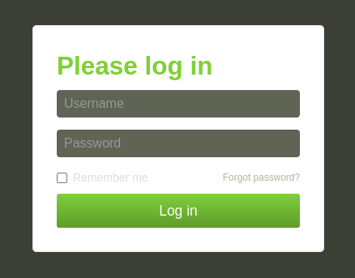

Once the Ansible script has completed, the Homer Dashboard will serve the information for each service.

Homer Dashboard Preview:

### Octoprint Setup:
##### Octoprint Login Credentials
- username: admin
- password: password

Once logged in the printer and general config parameters can be modified.

### Obico Setup:
##### Obico Login Credentials
- username/email: admin@example.com
- password: password