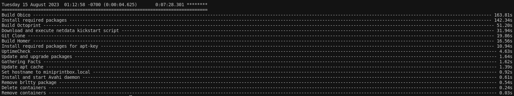

Tested on Ubuntu 22.04, other versions may work as well.

!!! warning

    Always ensure that important data is backed up before executing this script.

#### Clone Git Repo:

``` 
git clone https://github.com/hentronnumerouno/miniprintbox.git 
```

#### Change IP address to that of target machine

```
nano ~/miniprintbox/install/inventory.yml

```

##### Note: This script can be deployed on the local pc. 
- If wanted, uncomment this line in the inventory.yml files (one file in the 'install' directory and another in the 'remove' directory) `#127.0.0.1 ansible_connection=local
`

Begin Installation:

```
cd install
./install.sh
```
Once the installation is completed, the script will display the overview of the tasks, including the time it took to complete.

!!! note "Actual build time may vary depending on system specs."
    - System Type: Virtualized (Proxmox VE 7.4-16)
    - OS Version: Ubuntu 22.04 Cloud Image
    - Link Speed: 1 GB Symmetrical
    - Disk: 60 GB (bare minimum of 10 GBs needed for install)
    - CPU Cores: 6
    - Memory: 6 GB


[](images/ansible_time.png)

#### Congrats, install is now complete! You can now configure your setup :material-party-popper: :material-party-popper:

